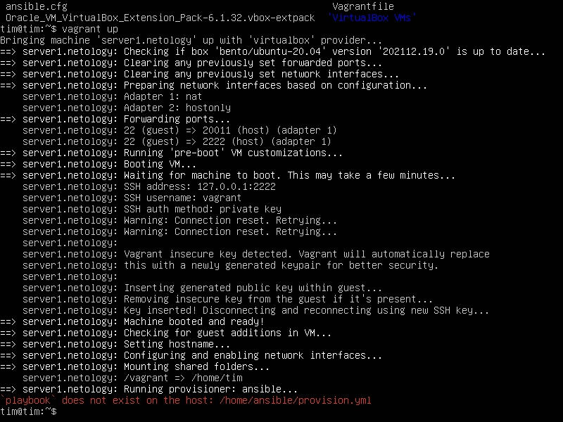

# Домашнее задание к занятию "5.2. Применение принципов IaaC в работе с виртуальными машинами"

---

## Задача 1

- Опишите своими словами основные преимущества применения на практике IaaC паттернов.
- Какой из принципов IaaC является основополагающим?

Ответ:
Основные преимущества "инфраструктуры как кода" IaaC или "программируемой инфраструктуры" 
1) С помощью автоматизации IaaC можно значительно ускорить развертывание инфрастуктуры и ускорить вывод продукта на рынок.  
Также IaaC позволяет ускорить и автоматизировать тестирование и масштабирование продукта.
2) IaaC позволяет обеспечить стабильность среды развертывания так как минимизирует действия ручного характера, обеспечивает типизацию конфигураций и обновлений сред разработки, тестирования  
3) IaaC позволяет ускорить разработку за счет более быстрого предоставления необходимой инфраструктуры тестирования и применения принципов CI/CD

## Задача 2

- Чем Ansible выгодно отличается от других систем управление конфигурациями?  
- Какой, на ваш взгляд, метод работы систем конфигурации более надёжный push или pull?  

Ответ:
1) Главные особенности ansible в том, что он является безагентным и безмастерным и использует существующую SSH инфраструктуру  
2) Полагаю, что более надежный push, так как он позволяет точно контролировать кто и когда получит соответствующие изменения, в некоторых ситуациях это может помочь предотвратить отправку конфигураций с ошибкой  

## Задача 3

Установить на личный компьютер:

- VirtualBox
- Vagrant
- Ansible

Ответ:
```shell
tim@tim:~$ vboxmanage --version
6.1.32r149290
tim@tim:~$ virtualbox --help | head -n 1 | awk '{print $NF}'
v6.1.32

tim@tim:~$ vagrant version
Installed Version: 2.2.19
Latest Version: 2.2.19

You're running an up-to-date version of Vagrant!

tim@tim:~$ ansible --version
ansible 2.9.6
  config file = /etc/ansible/ansible.cfg
  configured module search path = ['/home/tim/.ansible/plugins/modules', '/usr/share/ansible/plugins/modules']
  ansible python module location = /usr/lib/python3/dist-packages/ansible
  executable location = /usr/bin/ansible
  python version = 3.8.10 (default, Nov 26 2021, 20:14:08) [GCC 9.3.0]
```

*Приложить вывод команд установленных версий каждой из программ, оформленный в markdown.*

## Задача 4 (*)

Воспроизвести практическую часть лекции самостоятельно.

- Создать виртуальную машину.
- Зайти внутрь ВМ, убедиться, что Docker установлен с помощью команды
```
docker ps
```
Ответ:
