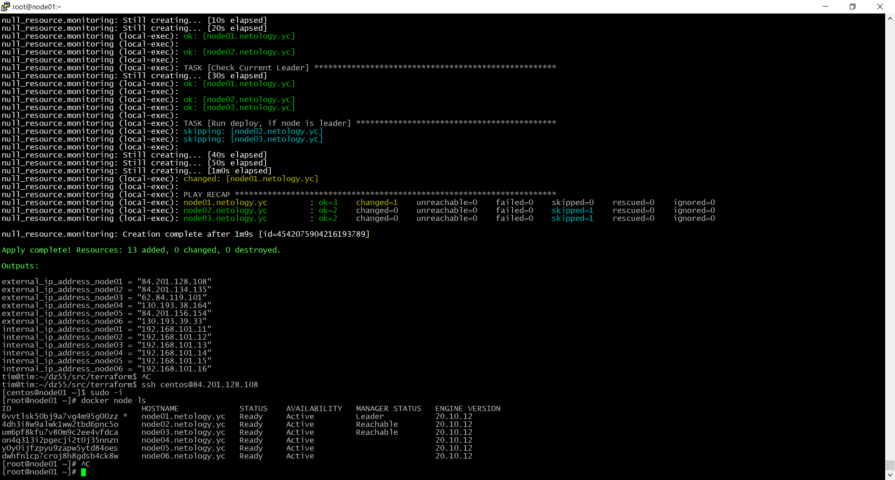
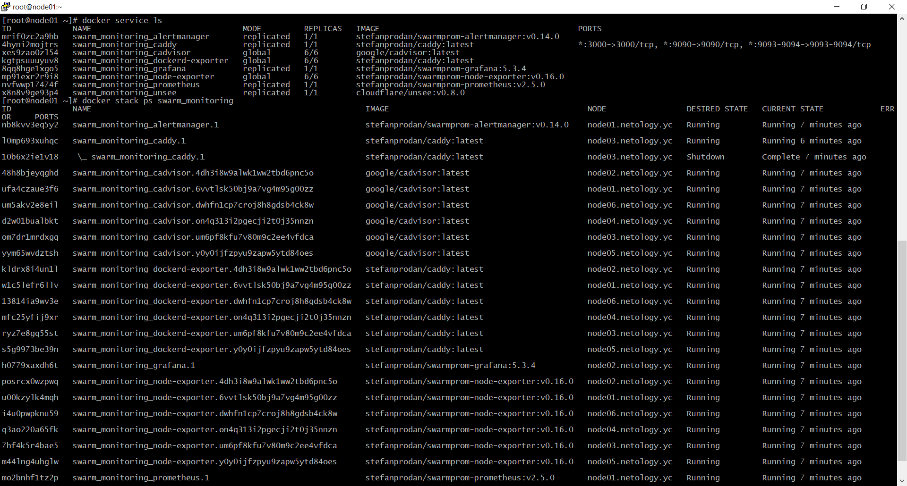

# Домашнее задание к занятию "5.5. Оркестрация кластером Docker контейнеров на примере Docker Swarm"

---

## Задача 1

Дайте письменые ответы на следующие вопросы:

- В чём отличие режимов работы сервисов в Docker Swarm кластере: replication и global?
- Какой алгоритм выбора лидера используется в Docker Swarm кластере?
- Что такое Overlay Network?

Ответ:
1) Режимы Replicated и Global. 
Существует два типа развертывания сервисов: replicated и global.
- Для реплицированного сервиса указываем, сколько идентичных задач нужно запустить. Например, развернуть сервис HTTP с тремя репликами, каждая из которых обслуживает один и тот же контент.  

- Глобальный сервис — это сервис, который запускает одну задачу на каждой ноде. Предварительно заданного количества задач нет. Каждый раз, добавляем ноду в swarm, оркестратор создает задачу, а планировщик назначает задачу новой ноде. По официальной документации, хорошими кандидатами на роль глобальных сервисов являются агенты мониторинга, антивирусные сканеры или другие типы контейнеров.    

2) Raft Consensus Algorithm  
All our nodes start in the follower state.  
If followers don't hear from a leader then they can become a candidate.  
The candidate then requests votes from other nodes.  
Nodes will reply with their vote.  
The candidate becomes the leader if it gets votes from a majority of nodes.  
This process is called Leader Election. 
All changes to the system now go through the leader.  
All changes to the system now go through the leader.
Each change is added as an entry in the node's log....  


3) Служебная распределенная сеть между узлами докера. Использует порт UDP 4789

## Задача 2

Создать ваш первый Docker Swarm кластер в Яндекс.Облаке

Для получения зачета, вам необходимо предоставить скриншот из терминала (консоли), с выводом команды:
```
docker node ls
```
Ответ:

## Задача 3

Создать ваш первый, готовый к боевой эксплуатации кластер мониторинга, состоящий из стека микросервисов.

Для получения зачета, вам необходимо предоставить скриншот из терминала (консоли), с выводом команды:
```
docker service ls
```
Ответ:


## Задача 4 (*)

Выполнить на лидере Docker Swarm кластера команду (указанную ниже) и дать письменное описание её функционала, что она делает и зачем она нужна:
```
# см.документацию: https://docs.docker.com/engine/swarm/swarm_manager_locking/
docker swarm update --autolock=true
```
Ответ:
Raft logs, используемые managers swarm, по умолчанию зашифрованы на диске. Это шифрование в состоянии покоя защищает конфигурацию и данные вашего сервиса от злоумышленников, которые пытаются получить доступ к зашифрованным logs Raft. Одна из причин, по которой эта функция была введена, заключалась в поддержке функции Docker secrets.  

При перезапуске Docker в память каждого управляющего узла загружается как ключ TLS, используемый для шифрования связи между узлами swarm, так и ключ, используемый для шифрования и расшифровки logs Raft на диске. Docker может защитить общий ключ шифрования TLS и ключ, используемый для шифрования и расшифровки Raft logs в состоянии покоя, позволяя вам стать владельцем этих ключей и требовать ручной разблокировки ваших менеджеров. Эта функция называется автоблокировкой.

Когда Docker перезапустится, вы должны сначала разблокировать swarm, используя ключ шифрования, сгенерированный Docker, когда swarm был заблокирован. Вы можете изменить этот ключ шифрования в любое время.

```shell
[root@node01 ~]# docker swarm update --autolock=true
Swarm updated.
To unlock a swarm manager after it restarts, run the `docker swarm unlock`
command and provide the following key:

    SWMKEY-1-

Please remember to store this key in a password manager, since without it you
will not be able to restart the manager.

```