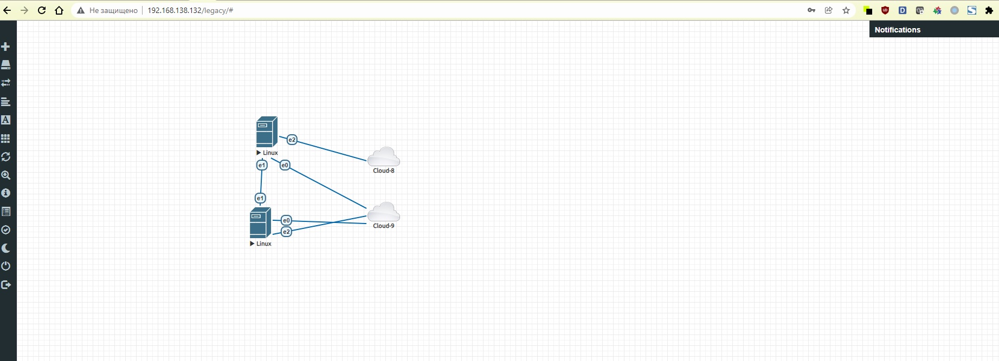

# Домашнее задание к занятию "3.7. Компьютерные сети, лекция 2"

1. Проверьте список доступных сетевых интерфейсов на вашем компьютере. Какие команды есть для этого в Linux и в Windows?

Ответ:
Windows
```shell
ipconfig

Windows IP Configuration
Unknown adapter VPN - VPN Client:
   Media State . . . . . . . . . . . : Media disconnected
   Connection-specific DNS Suffix  . :
Ethernet adapter Ethernet 3:
   Media State . . . . . . . . . . . : Media disconnected
   Connection-specific DNS Suffix  . :
Unknown adapter OpenVPN Wintun:
   Media State . . . . . . . . . . . : Media disconnected
   Connection-specific DNS Suffix  . :
Ethernet adapter vEthernet (WSL):
   Connection-specific DNS Suffix  . :
   Link-local IPv6 Address . . . . . : fe80::c507:d8eb:eb01:dfb9%56
   IPv4 Address. . . . . . . . . . . : 172.22.240.1
   Subnet Mask . . . . . . . . . . . : 255.255.240.0
   Default Gateway . . . . . . . . . :
Wireless LAN adapter Wi-Fi:
   Media State . . . . . . . . . . . : Media disconnected
   Connection-specific DNS Suffix  . :
Ethernet adapter Ethernet 6:
   Connection-specific DNS Suffix  . :
   Link-local IPv6 Address . . . . . : fe80::c4d6:f0c0:e749:952%13
   IPv4 Address. . . . . . . . . . . : 192.168.56.1
   Subnet Mask . . . . . . . . . . . : 255.255.255.0
   Default Gateway . . . . . . . . . :
  
```
Linux
```shell
ip -c -br link
lo               UNKNOWN        00:00:00:00:00:00 <LOOPBACK,UP,LOWER_UP>
bond0            DOWN           be:dd:69:ef:bb:c7 <BROADCAST,MULTICAST,MASTER>
dummy0           DOWN           ea:0b:f4:fb:2f:8f <BROADCAST,NOARP>
eth0             UP             00:15:5d:79:59:51 <BROADCAST,MULTICAST,UP,LOWER_UP>
tunl0@NONE       DOWN           0.0.0.0 <NOARP>
sit0@NONE        DOWN           0.0.0.0 <NOARP>
   
```

2. Какой протокол используется для распознавания соседа по сетевому интерфейсу? Какой пакет и команды есть в Linux для этого?

Ответ:
Протокол lldp  
Пакет в linux lldpd  
Пакет поставил, но neighbors не вижу сосед пингуется  
```shell
tim@ubuntu:~$ lldpctl
-------------------------------------------------------------------------------
LLDP neighbors:
-------------------------------------------------------------------------------
tim@ubuntu:~$ sudo systemctl status lldpd
[sudo] password for tim:
● lldpd.service - LLDP daemon
     Loaded: loaded (/lib/systemd/system/lldpd.service; enabled; vendor preset: enabled)
     Active: active (running) since Mon 2021-12-06 08:47:38 UTC; 8min ago
       Docs: man:lldpd(8)
   Main PID: 607 (lldpd)
      Tasks: 2 (limit: 469)
     Memory: 4.7M
     CGroup: /system.slice/lldpd.service
             ├─607 lldpd: monitor.
             └─630 lldpd: no neighbor.

Dec 06 08:47:38 ubuntu lldpd[630]: /etc/localtime copied to chroot
Dec 06 08:47:38 ubuntu systemd[1]: Started LLDP daemon.
Dec 06 08:47:38 ubuntu lldpd[630]: protocol LLDP enabled
Dec 06 08:47:38 ubuntu lldpd[630]: protocol CDPv1 disabled
Dec 06 08:47:38 ubuntu lldpd[630]: protocol CDPv2 disabled
Dec 06 08:47:38 ubuntu lldpd[630]: protocol SONMP disabled
Dec 06 08:47:38 ubuntu lldpd[630]: protocol EDP disabled
Dec 06 08:47:38 ubuntu lldpd[630]: protocol FDP disabled
Dec 06 08:47:38 ubuntu lldpd[630]: libevent 2.1.11-stable initialized with epoll method
Dec 06 08:47:39 ubuntu lldpcli[629]: lldpd should resume operations


root@eve-ng:~# dhcp-lease
+------------------------------------------------------------------------------
| DHCPD ACTIVE LEASES REPORT
+-----------------+-------------------+----------------------+-----------------
| IP Address      | MAC Address       | Expires (days,H:M:S) | Client Hostname
+-----------------+-------------------+----------------------+-----------------
| 192.168.255.11  | 00:50:00:00:02:00 |              0:09:03 | ubuntu
| 192.168.255.12  | 00:50:00:00:01:00 |              0:05:29 | ubuntu
+-----------------+-------------------+----------------------+-----------------
| Total Active Leases: 2
| Report generated (UTC): 2021-12-06 08:55:21
+------------------------------------------------------------------------------
tim@ubuntu:~$ ip a
1: lo: <LOOPBACK,UP,LOWER_UP> mtu 65536 qdisc noqueue state UNKNOWN group default qlen 1000
    link/loopback 00:00:00:00:00:00 brd 00:00:00:00:00:00
    inet 127.0.0.1/8 scope host lo
       valid_lft forever preferred_lft forever
    inet6 ::1/128 scope host
       valid_lft forever preferred_lft forever
2: ens3: <BROADCAST,MULTICAST,UP,LOWER_UP> mtu 1500 qdisc fq_codel state UP group default qlen 1000
    link/ether 00:50:00:00:02:00 brd ff:ff:ff:ff:ff:ff
    inet 192.168.255.11/24 brd 192.168.255.255 scope global dynamic ens3
       valid_lft 432sec preferred_lft 432sec
    inet6 fe80::250:ff:fe00:200/64 scope link
       valid_lft forever preferred_lft forever
3: ens4: <BROADCAST,MULTICAST> mtu 1500 qdisc noop state DOWN group default qlen 1000
    link/ether 00:50:00:00:02:01 brd ff:ff:ff:ff:ff:ff
4: ens5: <BROADCAST,MULTICAST> mtu 1500 qdisc noop state DOWN group default qlen 1000
    link/ether 00:50:00:00:02:02 brd ff:ff:ff:ff:ff:ff
tim@ubuntu:~$ ping 192.168.255.12
PING 192.168.255.12 (192.168.255.12) 56(84) bytes of data.
64 bytes from 192.168.255.12: icmp_seq=1 ttl=64 time=2.31 ms
64 bytes from 192.168.255.12: icmp_seq=2 ttl=64 time=1.88 ms
64 bytes from 192.168.255.12: icmp_seq=3 ttl=64 time=1.15 ms

```

3. Какая технология используется для разделения L2 коммутатора на несколько виртуальных сетей? Какой пакет и команды есть в Linux для этого? Приведите пример конфига.

Ответ:  
Технология VLAN   
Пакет vlan (apt install vlan)
```shell
tim@ubuntu:~$ sudo vconfig add ens6 4000

Warning: vconfig is deprecated and might be removed in the future, please migrate to ip(route2) as soon as possible!

5: ens6: <BROADCAST,MULTICAST> mtu 1500 qdisc noop state DOWN group default qlen 1000
    link/ether 00:50:00:00:01:03 brd ff:ff:ff:ff:ff:ff

tim@ubuntu:~$ cat /etc/network/interfaces
auto ens6.4000
iface ens6.4000 inet static
        address 192.168.50.1
        netmask 255.255.255.0
        vlan_raw_device ens6

```
4. Какие типы агрегации интерфейсов есть в Linux? Какие опции есть для балансировки нагрузки? Приведите пример конфига.

Ответ:
Типы LAG статический и динамический (LACP)
В зависимости от модели коммутатора, могут поддерживаться такие методы балансировки:  

по MAC-адресу отправителя или MAC-адресу получателя или учитывая оба адреса  
по IP-адресу отправителя или IP-адресу получателя или учитывая оба адреса  
по номеру порта отправителя или номеру порта получателя или учитывая оба порта  
```shell
sw1(config)# port-channel load-balance ?
  dst-ip       Dst IP Addr
  dst-mac      Dst Mac Addr
  src-dst-ip   Src XOR Dst IP Addr
  src-dst-mac  Src XOR Dst Mac Addr
  src-ip       Src IP Addr
  src-mac      Src Mac Addr
```

```shell
tim@ubuntu:~$ sudo cat /etc/network/interfaces
auto ens6.4000
iface ens6.4000 inet static
        address 192.168.50.1
        netmask 255.255.255.0
        vlan_raw_device ens6

auto bond0
iface bond0 inet manual
        bond-slaves ens8 ens9
# bond-mode 4 = 802.3ad AKA LACP
        bond-mode 4
        bond-miimon 100
        bond-downdelay 200
        bond-updelay 200
        bond-lacp-rate 1
        bond-xmit-hash-policy layer2+3
        up ifconfig bond0 0.0.0.0 up

```
5. Сколько IP адресов в сети с маской /29 ? Сколько /29 подсетей можно получить из сети с маской /24. Приведите несколько примеров /29 подсетей внутри сети 10.10.10.0/24.

Ответ:
- a.b.c.d/29  8 адресов  
- 32 подсети
- 10.10.10.0/29  
10.10.10.8/29  
10.10.10.16/29  
10.10.10.24/29  
10.10.10.32/29  
10.10.10.40/29  
10.10.10.48/29  
10.10.10.56/29  
10.10.10.64/29  
10.10.10.72/29  
10.10.10.80/29  
10.10.10.88/29  
10.10.10.96/29  
10.10.10.104/29  
10.10.10.112/29  
10.10.10.120/29  
10.10.10.128/29  
10.10.10.136/29  
10.10.10.144/29  
10.10.10.152/29  
10.10.10.160/29  
10.10.10.168/29  
10.10.10.176/29  
10.10.10.184/29  
10.10.10.192/29  
10.10.10.200/29  
10.10.10.208/29  
10.10.10.216/29  
10.10.10.224/29  
10.10.10.232/29  
10.10.10.240/29  
10.10.10.248/29  

6. Задача: вас попросили организовать стык между 2-мя организациями. Диапазоны 10.0.0.0/8, 172.16.0.0/12, 192.168.0.0/16 уже заняты. Из какой подсети допустимо взять частные IP адреса? Маску выберите из расчета максимум 40-50 хостов внутри подсети.

Ответ:
100.64.0.0/26

7. Как проверить ARP таблицу в Linux, Windows? Как очистить ARP кеш полностью? Как из ARP таблицы удалить только один нужный IP?

Ответ:
 
```shell
tim@ubuntu:~$ arp -a
_gateway (192.168.255.1) at 3e:f9:85:64:71:a7 [ether] on ens3
? (192.168.255.11) at 00:50:00:00:02:00 [ether] on ens3

tim@ubuntu:~$ arp -d 192.168.255.11
tim@ubuntu:~$ arp -a
_gateway (192.168.255.1) at 3e:f9:85:64:71:a7 [ether] on ens3

tim@ubuntu:~$ ip neigh flush all

```

```shell
C:\Users\Тимофей>arp -a

Interface: 192.168.149.1 --- 0x9
  Internet Address      Physical Address      Type
  192.168.149.255       ff-ff-ff-ff-ff-ff     static
  224.0.0.22            01-00-5e-00-00-16     static
  224.0.0.251           01-00-5e-00-00-fb     static
  224.0.0.252           01-00-5e-00-00-fc     static
  239.255.255.250       01-00-5e-7f-ff-fa     static

C:\Users\Тимофей>arp -d 192.168.149.1..
  
C:\Users\Тимофей>netsh interface ip delete arpcache
```

 ---
## Задание для самостоятельной отработки (необязательно к выполнению)

 8*. Установите эмулятор EVE-ng.
 
 Инструкция по установке - https://github.com/svmyasnikov/eve-ng

 Выполните задания на lldp, vlan, bonding в эмуляторе EVE-ng. 
 
Установлено


```shell
root@eve-ng:~# dhcp-lease
+------------------------------------------------------------------------------
| DHCPD ACTIVE LEASES REPORT
+-----------------+-------------------+----------------------+-----------------
| IP Address      | MAC Address       | Expires (days,H:M:S) | Client Hostname
+-----------------+-------------------+----------------------+-----------------
| 192.168.255.11  | 00:50:00:00:02:00 |              0:09:27 | ubuntu
| 192.168.255.12  | 00:50:00:00:01:00 |              0:06:48 | ubuntu
+-----------------+-------------------+----------------------+-----------------
| Total Active Leases: 2
| Report generated (UTC): 2021-12-06 09:46:52
+------------------------------------------------------------------------------

```
