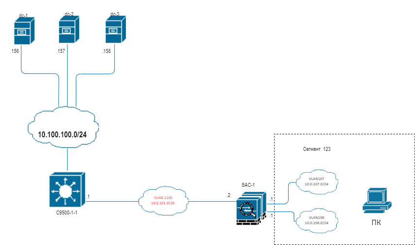

# Домашнее задание к занятию "3.8. Компьютерные сети, лекция 3"

1. Подключитесь к публичному маршрутизатору в интернет. Найдите маршрут к вашему публичному IP
```
telnet route-views.routeviews.org
Username: rviews
show ip route x.x.x.x/32
show bgp x.x.x.x/32
```
Ответ:
```shell
route-views>show ip route 217.170.85.195
Routing entry for 217.170.64.0/19, supernet
  Known via "bgp 6447", distance 20, metric 0
  Tag 6939, type external
  Last update from 64.71.137.241 2d07h ago
  Routing Descriptor Blocks:
  * 64.71.137.241, from 64.71.137.241, 2d07h ago
      Route metric is 0, traffic share count is 1
      AS Hops 3
      Route tag 6939
      MPLS label: none
```
```shell
route-views>show bgp 217.170.85.195/32
% Network not in table

BGP routing table entry for 217.170.64.0/19, version 1394990502
Paths: (24 available, best #16, table default)
  Not advertised to any peer
  Refresh Epoch 3
  3303 3216 20597
    217.192.89.50 from 217.192.89.50 (138.187.128.158)
      Origin IGP, localpref 100, valid, external
      Community: 3216:2001 3216:4478 3303:1004 3303:1006 3303:1030 3303:3056
      path 7FE17A71ED28 RPKI State not found
      rx pathid: 0, tx pathid: 0
  Refresh Epoch 1
  4901 6079 1299 3216 20597
    162.250.137.254 from 162.250.137.254 (162.250.137.254)
      Origin IGP, localpref 100, valid, external
      Community: 65000:10100 65000:10300 65000:10400
      path 7FE0370C4A20 RPKI State not found
      rx pathid: 0, tx pathid: 0
  Refresh Epoch 1
  7660 2516 1273 3216 20597
    203.181.248.168 from 203.181.248.168 (203.181.248.168)
      Origin IGP, localpref 100, valid, external
      Community: 2516:1030 7660:9003
      path 7FE09D6A1B98 RPKI State not found
      rx pathid: 0, tx pathid: 0
  Refresh Epoch 1
  3267 3216 20597
    194.85.40.15 from 194.85.40.15 (185.141.126.1)
      Origin IGP, metric 0, localpref 100, valid, external
      path 7FE09B499E18 RPKI State not found
 --More--
```
2. Создайте dummy0 интерфейс в Ubuntu. Добавьте несколько статических маршрутов. Проверьте таблицу маршрутизации.

Ответ:
```shell
root@ubuntu:/home/tim# ip link add name dummy0 type dummy
root@ubuntu:/home/tim# ip a
1: lo: <LOOPBACK,UP,LOWER_UP> mtu 65536 qdisc noqueue state UNKNOWN group default qlen 1000
    link/loopback 00:00:00:00:00:00 brd 00:00:00:00:00:00
    inet 127.0.0.1/8 scope host lo
       valid_lft forever preferred_lft forever
    inet6 ::1/128 scope host
       valid_lft forever preferred_lft forever
2: ens3: <BROADCAST,MULTICAST,UP,LOWER_UP> mtu 1500 qdisc fq_codel state UP group default qlen 1000
    link/ether 00:50:00:00:03:00 brd ff:ff:ff:ff:ff:ff
    inet 192.168.255.12/24 brd 192.168.255.255 scope global dynamic ens3
       valid_lft 388sec preferred_lft 388sec
    inet6 fe80::250:ff:fe00:300/64 scope link
       valid_lft forever preferred_lft forever
....
    link/ether 00:50:00:00:03:04 brd ff:ff:ff:ff:ff:ff
7: ens8: <BROADCAST,MULTICAST> mtu 1500 qdisc noop state DOWN group default qlen 1000
    link/ether 00:50:00:00:03:05 brd ff:ff:ff:ff:ff:ff
8: dummy0: <BROADCAST,NOARP> mtu 1500 qdisc noop state DOWN group default qlen 1000
    link/ether aa:06:5e:b2:5a:41 brd ff:ff:ff:ff:ff:ff

root@ubuntu:/home/tim# cat /etc/systemd/network/dummy0.netdev
[NetDev]
Name=dummy0
Kind=dummy
root@ubuntu:/home/tim# cat /etc/systemd/network/dummy0.network
[Match]
Name=dummy0
[Network]
Address=10.3.3.3
Mask=255.255.255.255

root@ubuntu:/home/tim# sudo systemctl restart systemd-networkd
root@ubuntu:/home/tim# ip a
1: lo: <LOOPBACK,UP,LOWER_UP> mtu 65536 qdisc noqueue state UNKNOWN group default len 1000
    link/loopback 00:00:00:00:00:00 brd 00:00:00:00:00:00
    inet 127.0.0.1/8 scope host lo
       valid_lft forever preferred_lft forever
    inet6 ::1/128 scope host
       valid_lft forever preferred_lft forever
.....
8: dummy0: <BROADCAST,NOARP,UP,LOWER_UP> mtu 1500 qdisc noqueue state UNKNOWN grou default qlen 1000
    link/ether aa:06:5e:b2:5a:41 brd ff:ff:ff:ff:ff:ff
    inet 10.3.3.3/8 brd 10.255.255.255 scope global dummy0
       valid_lft forever preferred_lft forever
    inet6 fe80::a806:5eff:feb2:5a41/64 scope link
       valid_lft forever preferred_lft forever

root@ubuntu:/home/tim# ip route add 192.168.40.0/24 dev dummy0 metric 120
root@ubuntu:/home/tim# ip route add 192.168.20.0/24 via 192.168.255.12

root@ubuntu:/home/tim# ip -br route
default via 192.168.255.1 dev ens3 proto dhcp src 192.168.255.12 metric 100
10.0.0.0/8 dev dummy0 proto kernel scope link src 10.3.3.3
192.168.20.0/24 via 192.168.255.12 dev ens3
192.168.40.0/24 dev dummy0 scope link metric 120
192.168.255.0/24 dev ens3 proto kernel scope link src 192.168.255.12
192.168.255.1 dev ens3 proto dhcp scope link src 192.168.255.12 metric 100


```

3. Проверьте открытые TCP порты в Ubuntu, какие протоколы и приложения используют эти порты? Приведите несколько примеров.

Протокол ssh например, у меня мало октрытых к сожалению ).
Ответ:
```shell
root@ubuntu:/home/tim# ss -tls
Total: 144
TCP:   4 (estab 1, closed 0, orphaned 0, timewait 0)

Transport Total     IP        IPv6
RAW       2         0         2
UDP       2         2         0
TCP       4         3         1
INET      8         5         3
FRAG      0         0         0

State                       Recv-Q                      Send-Q                                           Local Address:Port                                              Peer Address:Port                      Process
LISTEN                      0                           4096                                             127.0.0.53%lo:domain                                                 0.0.0.0:*
LISTEN                      0                           128                                                    0.0.0.0:ssh                                                    0.0.0.0:*
LISTEN                      0                           128                                                       [::]:ssh                                                       [::]:*

root@ubuntu:/home/tim# ss -t
State                      Recv-Q                      Send-Q                                            Local Address:Port                                             Peer Address:Port                       Process
ESTAB                      0                           36                                               192.168.255.12:ssh                                             192.168.255.1:52756

```

4. Проверьте используемые UDP сокеты в Ubuntu, какие протоколы и приложения используют эти порты?

Ответ:
ПО udp
```shell
root@ubuntu:/home/tim# ss -ul
State                      Recv-Q                     Send-Q                                                Local Address:Port                                             Peer Address:Port                     Process
UNCONN                     0                          0                                               192.168.255.12%ens3:bootpc                                                0.0.0.0:*
UNCONN                     0                          0                                                           0.0.0.0:46771                                                 0.0.0.0:*
UNCONN                     0                          0                                                     127.0.0.53%lo:domain                                                0.0.0.0:*

root@ubuntu:/home/tim# ss -ulp
State                  Recv-Q                 Send-Q                                       Local Address:Port                                   Peer Address:Port                 Process
UNCONN                 0                      0                                      192.168.255.12%ens3:bootpc                                      0.0.0.0:*                     users:(("systemd-network",pid=994,fd=22))
UNCONN                 0                      0                                            127.0.0.53%lo:domain                                      0.0.0.0:*                     users:(("systemd-resolve",pid=589,fd=12))

root@eve-ng:~# ss -ua
State       Recv-Q Send-Q                                                                       Local Address:Port                                                                                        Peer Address:Port
UNCONN      0      0                                                                                        *:7447                                                                                                   *:*
UNCONN      0      0                                                                                        *:bootps                                                                                                 *:*
UNCONN      0      0                                                                                        *:bootpc                                                                                                 *:*
UNCONN      0      0                                                                            192.168.255.1:ntp                                                                                                    *:*
UNCONN      0      0                                                                            192.168.250.1:ntp                                                                                                    *:*
UNCONN      0      0                                                                          192.168.138.132:ntp                                                                                                    *:*
UNCONN      0      0                                                                                127.0.0.1:ntp                                                                                                    *:*
UNCONN      0      0                                                                                        *:ntp               
```
5. Используя diagrams.net, создайте L3 диаграмму вашей домашней сети или любой другой сети, с которой вы работали. 


 ---
## Задание для самостоятельной отработки (необязательно к выполнению)

6*. Установите Nginx, настройте в режиме балансировщика TCP или UDP.

Ответ:
```shell
tim@ubuntu:~$ sudo systemctl start nginx
tim@ubuntu:~$ curl -4 192.168.255.12
<!DOCTYPE html>
<html>
<head>
<title>Welcome to nginx!</title>
<style>
    body {
        width: 35em;
        margin: 0 auto;
        font-family: Tahoma, Verdana, Arial, sans-serif;
    }
</style>
</head>
<body>
<h1>Welcome to nginx!</h1>
<p>If you see this page, the nginx web server is successfully installed and
working. Further configuration is required.</p>

<p>For online documentation and support please refer to
<a href="http://nginx.org/">nginx.org</a>.<br/>
Commercial support is available at
<a href="http://nginx.com/">nginx.com</a>.</p>

<p><em>Thank you for using nginx.</em></p>
</body>
</html>
tim@ubuntu:~$ sudo systemctl enable nginx

tim@ubuntu:~$ cat /etc/nginx/nginx.conf
user www-data;
worker_processes auto;
pid /run/nginx.pid;
include /etc/nginx/modules-enabled/*.conf;

events {
        worker_connections 768;
        # multi_accept on;
}

http {

        ##
        # Basic Settings
        ##

        sendfile on;
        tcp_nopush on;
        tcp_nodelay on;
        keepalive_timeout 65;
        types_hash_max_size 2048;
        # server_tokens off;

        # server_names_hash_bucket_size 64;
        # server_name_in_redirect off;

        include /etc/nginx/mime.types;
        default_type application/octet-stream;

        ##
        # SSL Settings
        ##

        ssl_protocols TLSv1 TLSv1.1 TLSv1.2 TLSv1.3; # Dropping SSLv3, ref: POODLE
        ssl_prefer_server_ciphers on;

        ##
        # Logging Settings
        ##

        access_log /var/log/nginx/access.log;
        error_log /var/log/nginx/error.log;

        ##
        # Gzip Settings
        ##

        gzip on;

        # gzip_vary on;
        # gzip_proxied any;
        # gzip_comp_level 6;
        # gzip_buffers 16 8k;
        # gzip_http_version 1.1;
        # gzip_types text/plain text/css application/json application/javascript text/xml application/xml application/xml+rss text/javascript;

        ##
        # Virtual Host Configs
        ##

        include /etc/nginx/conf.d/*.conf;
        include /etc/nginx/sites-enabled/*;
}

stream {
  upstream dns_backends {
    server 8.8.8.8:53;
    server 8.8.4.4:53;
  }

  server {
    listen 53 udp;
    proxy_pass dns_backends;
    proxy_responses 1;
  }
}
   proxy_pass dns_backends;
    proxy_responses 1;
  }
}

stream {
  upstream tcp_backend {
    server srv1.example.com:3306;
    server srv2.example.com:3306;
  }
  server {
    listen 3306;
    proxy_pass tcp_backend;
  }
}

```

7*. Установите bird2, настройте динамический протокол маршрутизации RIP.
```shell
tim@ubuntu:~$ sudo birdc show route
BIRD 2.0.7 ready.
tim@ubuntu:~$ sudo bird -c /etc/bird.conf
bird> show rip interfaces
rip1:
Interface  State  Metric   Nbrs   Timer
ens3       Up          1      0  17.942
dummy0     Up          1      0   5.533

```

8*. Установите Netbox, создайте несколько IP префиксов, используя curl проверьте работу API.

```shell
(venv) tim@ubuntu:/opt/netbox/netbox$ python3 manage.py runserver 0.0.0.0:8000 --insecure
Performing system checks...

System check identified no issues (0 silenced).
December 07, 2021 - 13:13:03
Django version 3.2.9, using settings 'netbox.settings'
Starting development server at http://0.0.0.0:8000/
Quit the server with CONTROL-C.
[07/Dec/2021 13:13:25] "GET / HTTP/1.1" 200 86015
[07/Dec/2021 13:13:25] "GET /static/netbox-external.css HTTP/1.1" 200 286568
[07/Dec/2021 13:13:26] "GET /static/netbox-light.css HTTP/1.1" 200 493634
[07/Dec/2021 13:13:26] "GET /static/netbox.js HTTP/1.1" 200 322806
[07/Dec/2021 13:13:26] "GET /static/netbox_logo.svg HTTP/1.1" 200 4719
[07/Dec/2021 13:13:26] "GET /static/netbox-dark.css HTTP/1.1" 200 788878
[07/Dec/2021 13:13:26] "GET /static/netbox_icon.svg HTTP/1.1" 200 835
[07/Dec/2021 13:13:26] "GET /static/materialdesignicons-webfont-KSYPMDN6.woff2?v=5.9.55 HTTP/1.1" 200 325244
[07/Dec/2021 13:13:26] "GET /static/netbox-print.css HTTP/1.1" 200 1623706
[07/Dec/2021 13:13:26] "GET /static/netbox.ico HTTP/1.1" 200 1174
[07/Dec/2021 13:14:05] "GET /login/ HTTP/1.1" 200 8128
[07/Dec/2021 13:14:12] "POST /login/ HTTP/1.1" 302 0
[07/Dec/2021 13:14:13] "GET / HTTP/1.1" 200 136657
[07/Dec/2021 13:14:40] "GET /dcim/power-panels/ HTTP/1.1" 200 134986
[07/Dec/2021 13:14:46] "GET /dcim/devices/ HTTP/1.1" 200 152661
[07/Dec/2021 13:14:59] "GET /virtualization/virtual-machines/import/ HTTP/1.1" 200 146279

```

