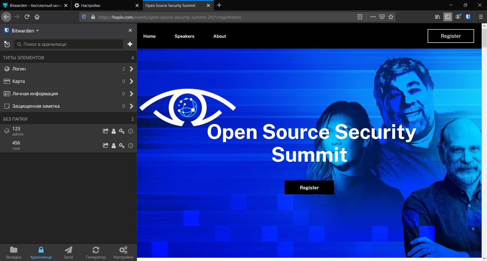
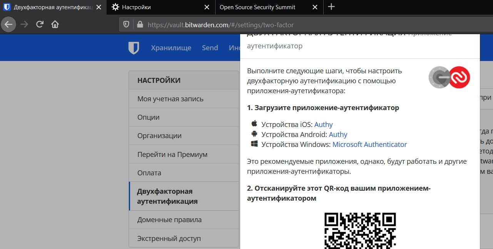
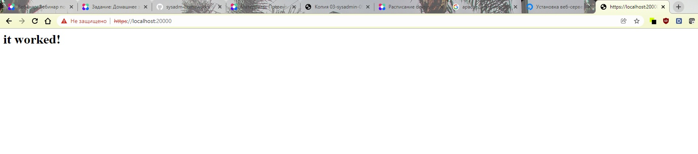

# Домашнее задание к занятию "3.9. Элементы безопасности информационных систем"

1. Установите Bitwarden плагин для браузера. Зарегестрируйтесь и сохраните несколько паролей.  
Ответ:


2. Установите Google authenticator на мобильный телефон. Настройте вход в Bitwarden акаунт через Google authenticator OTP.
Ответ:
Сделано, телефон скриншот сделать не дает )

3. Установите apache2, сгенерируйте самоподписанный сертификат, настройте тестовый сайт для работы по HTTPS.
Ответ:
```shell
vagrant@vagrant:~$ sudo systemctl status apache2
● apache2.service - The Apache HTTP Server
     Loaded: loaded (/lib/systemd/system/apache2.service; enabled; vendor preset: enabled)
     Active: active (running) since Wed 2021-12-08 13:03:19 UTC; 24min ago
       Docs: https://httpd.apache.org/docs/2.4/
    Process: 2245 ExecReload=/usr/sbin/apachectl graceful (code=exited, status=0/SUCCESS)
   Main PID: 819 (apache2)
      Tasks: 55 (limit: 1071)
     Memory: 9.5M
     CGroup: /system.slice/apache2.service
             ├─ 819 /usr/sbin/apache2 -k start
             ├─2250 /usr/sbin/apache2 -k start
             └─2251 /usr/sbin/apache2 -k start

Dec 08 13:03:18 vagrant systemd[1]: Starting The Apache HTTP Server...
Dec 08 13:03:19 vagrant apachectl[793]: AH00558: apache2: Could not reliably determine the server's fully qualified domain name, using 127.0.1.1. Set the '>
Dec 08 13:03:19 vagrant systemd[1]: Started The Apache HTTP Server.
Dec 08 13:25:53 vagrant systemd[1]: Reloading The Apache HTTP Server.
Dec 08 13:25:53 vagrant apachectl[2248]: AH00558: apache2: Could not reliably determine the server's fully qualified domain name, using 127.0.1.1. Set the >
Dec 08 13:25:53 vagrant systemd[1]: Reloaded The Apache HTTP Server.

vagrant@vagrant:~$ sudo apache2ctl configtest
AH00558: apache2: Could not reliably determine the server's fully qualified domain name, using 127.0.1.1. Set the 'ServerName' directive globally to suppress this message
Syntax OK
```

4. Проверьте на TLS уязвимости произвольный сайт в интернете (кроме сайтов МВД, ФСБ, МинОбр, НацБанк, РосКосмос, РосАтом, РосНАНО и любых госкомпаний, объектов КИИ, ВПК ... и тому подобное).  
Ответ:
```shell
vagrant@vagrant:~/testssl.sh$ ./testssl.sh -U --sneaky https://amazon.com/

###########################################################
    testssl.sh       3.1dev from https://testssl.sh/dev/
    (dc782a8 2021-12-08 11:50:55 -- )

      This program is free software. Distribution and
             modification under GPLv2 permitted.
      USAGE w/o ANY WARRANTY. USE IT AT YOUR OWN RISK!

       Please file bugs @ https://testssl.sh/bugs/

###########################################################

 Using "OpenSSL 1.0.2-chacha (1.0.2k-dev)" [~183 ciphers]
 on vagrant:./bin/openssl.Linux.x86_64
 (built: "Jan 18 17:12:17 2019", platform: "linux-x86_64")


Testing all IPv4 addresses (port 443): 54.239.28.85 176.32.103.205 205.251.242.103
--------------------------------------------------------------------------------------------------------
 Start 2021-12-08 13:32:39        -->> 54.239.28.85:443 (amazon.com) <<--

 Further IP addresses:   205.251.242.103 176.32.103.205
 rDNS (54.239.28.85):    --
 Service detected:       HTTP


 Testing vulnerabilities

 Heartbleed (CVE-2014-0160)                not vulnerable (OK), no heartbeat extension
 CCS (CVE-2014-0224)                       not vulnerable (OK)
 Ticketbleed (CVE-2016-9244), experiment.  not vulnerable (OK), no session ticket extension
 ROBOT                                     not vulnerable (OK)
 Secure Renegotiation (RFC 5746)           supported (OK)
 Secure Client-Initiated Renegotiation     not vulnerable (OK)
 CRIME, TLS (CVE-2012-4929)                not vulnerable (OK)
 BREACH (CVE-2013-3587)                    no gzip/deflate/compress/br HTTP compression (OK)  - only supplied "/" tested
 POODLE, SSL (CVE-2014-3566)               not vulnerable (OK)
 TLS_FALLBACK_SCSV (RFC 7507)              Downgrade attack prevention supported (OK)
 SWEET32 (CVE-2016-2183, CVE-2016-6329)    not vulnerable (OK)
 FREAK (CVE-2015-0204)                     not vulnerable (OK)
 DROWN (CVE-2016-0800, CVE-2016-0703)      not vulnerable on this host and port (OK)
                                           make sure you don't use this certificate elsewhere with SSLv2 enabled services
                                           https://censys.io/ipv4?q=5BF3D7E0E6927F773D5106C822C53F6F52C199F7EB1B3B8154B41F2924391C75 could help you to find out
 LOGJAM (CVE-2015-4000), experimental      not vulnerable (OK): no DH EXPORT ciphers, no DH key detected with <= TLS 1.2
 BEAST (CVE-2011-3389)                     TLS1: ECDHE-RSA-AES128-SHA AES128-SHA
                                           VULNERABLE -- but also supports higher protocols  TLSv1.1 TLSv1.2 (likely mitigated)
 LUCKY13 (CVE-2013-0169), experimental     potentially VULNERABLE, uses cipher block chaining (CBC) ciphers with TLS. Check patches
 Winshock (CVE-2014-6321), experimental    not vulnerable (OK) - CAMELLIA or ECDHE_RSA GCM ciphers found
 RC4 (CVE-2013-2566, CVE-2015-2808)        no RC4 ciphers detected (OK)


 Done 2021-12-08 13:34:16 [ 115s] -->> 54.239.28.85:443 (amazon.com) <<--

--------------------------------------------------------------------------------------------------------
 Start 2021-12-08 13:34:18        -->> 176.32.103.205:443 (amazon.com) <<--

 Further IP addresses:   205.251.242.103 54.239.28.85
 rDNS (176.32.103.205):  --
 Service detected:       HTTP


 Testing vulnerabilities

 Heartbleed (CVE-2014-0160)                not vulnerable (OK), no heartbeat extension
 CCS (CVE-2014-0224)                       not vulnerable (OK)
 Ticketbleed (CVE-2016-9244), experiment.  not vulnerable (OK), no session ticket extension
 ROBOT                                     not vulnerable (OK)
 Secure Renegotiation (RFC 5746)           supported (OK)
 Secure Client-Initiated Renegotiation     not vulnerable (OK)
 CRIME, TLS (CVE-2012-4929)                not vulnerable (OK)
 BREACH (CVE-2013-3587)                    no gzip/deflate/compress/br HTTP compression (OK)  - only supplied "/" tested
 POODLE, SSL (CVE-2014-3566)               not vulnerable (OK)
 TLS_FALLBACK_SCSV (RFC 7507)              Downgrade attack prevention supported (OK)
 SWEET32 (CVE-2016-2183, CVE-2016-6329)    not vulnerable (OK)
 FREAK (CVE-2015-0204)                     not vulnerable (OK)
 DROWN (CVE-2016-0800, CVE-2016-0703)      not vulnerable on this host and port (OK)
                                           make sure you don't use this certificate elsewhere with SSLv2 enabled services
                                           https://censys.io/ipv4?q=5BF3D7E0E6927F773D5106C822C53F6F52C199F7EB1B3B8154B41F2924391C75 could help you to find out
 LOGJAM (CVE-2015-4000), experimental      not vulnerable (OK): no DH EXPORT ciphers, no DH key detected with <= TLS 1.2
 BEAST (CVE-2011-3389)                     TLS1: ECDHE-RSA-AES128-SHA AES128-SHA
                                           VULNERABLE -- but also supports higher protocols  TLSv1.1 TLSv1.2 (likely mitigated)
 LUCKY13 (CVE-2013-0169), experimental     potentially VULNERABLE, uses cipher block chaining (CBC) ciphers with TLS. Check patches
 Winshock (CVE-2014-6321), experimental    not vulnerable (OK) - CAMELLIA or ECDHE_RSA GCM ciphers found
 RC4 (CVE-2013-2566, CVE-2015-2808)        no RC4 ciphers detected (OK)


 Done 2021-12-08 13:35:57 [ 216s] -->> 176.32.103.205:443 (amazon.com) <<--

--------------------------------------------------------------------------------------------------------
 Start 2021-12-08 13:35:59        -->> 205.251.242.103:443 (amazon.com) <<--

 Further IP addresses:   176.32.103.205 54.239.28.85
 rDNS (205.251.242.103): --
 Service detected:       HTTP


 Testing vulnerabilities

 Heartbleed (CVE-2014-0160)                not vulnerable (OK), no heartbeat extension
 CCS (CVE-2014-0224)                       not vulnerable (OK)
 Ticketbleed (CVE-2016-9244), experiment.  not vulnerable (OK), no session ticket extension
 ROBOT                                     not vulnerable (OK)
 Secure Renegotiation (RFC 5746)           supported (OK)
 Secure Client-Initiated Renegotiation     not vulnerable (OK)
 CRIME, TLS (CVE-2012-4929)                not vulnerable (OK)
 BREACH (CVE-2013-3587)                    no gzip/deflate/compress/br HTTP compression (OK)  - only supplied "/" tested
 POODLE, SSL (CVE-2014-3566)               not vulnerable (OK)
 TLS_FALLBACK_SCSV (RFC 7507)              Downgrade attack prevention supported (OK)
 SWEET32 (CVE-2016-2183, CVE-2016-6329)    not vulnerable (OK)
 FREAK (CVE-2015-0204)                     not vulnerable (OK)
 DROWN (CVE-2016-0800, CVE-2016-0703)      not vulnerable on this host and port (OK)
                                           make sure you don't use this certificate elsewhere with SSLv2 enabled services
                                           https://censys.io/ipv4?q=5BF3D7E0E6927F773D5106C822C53F6F52C199F7EB1B3B8154B41F2924391C75 could help you to find out
 LOGJAM (CVE-2015-4000), experimental      not vulnerable (OK): no DH EXPORT ciphers, no DH key detected with <= TLS 1.2
 BEAST (CVE-2011-3389)                     TLS1: ECDHE-RSA-AES128-SHA AES128-SHA
                                           VULNERABLE -- but also supports higher protocols  TLSv1.1 TLSv1.2 (likely mitigated)
 LUCKY13 (CVE-2013-0169), experimental     potentially VULNERABLE, uses cipher block chaining (CBC) ciphers with TLS. Check patches
 Winshock (CVE-2014-6321), experimental    not vulnerable (OK) - CAMELLIA or ECDHE_RSA GCM ciphers found
 RC4 (CVE-2013-2566, CVE-2015-2808)        no RC4 ciphers detected (OK)


 Done 2021-12-08 13:37:40 [ 319s] -->> 205.251.242.103:443 (amazon.com) <<--

--------------------------------------------------------------------------------------------------------
Done testing now all IP addresses (on port 443): 54.239.28.85 176.32.103.205 205.251.242.103
```

5. Установите на Ubuntu ssh сервер, сгенерируйте новый приватный ключ. Скопируйте свой публичный ключ на другой сервер. Подключитесь к серверу по SSH-ключу.  
Ответ:
```shell
vagrant@vagrant:~$ ssh-keygen
Generating public/private rsa key pair.
Enter file in which to save the key (/home/vagrant/.ssh/id_rsa): 123
Enter passphrase (empty for no passphrase):
Enter same passphrase again:
Your identification has been saved in 123
Your public key has been saved in 123.pub
The key fingerprint is:
SHA256:m35eZayqDlH23aXFiJG+U5v7bApHgoW/FF7PSr/8smA vagrant@vagrant
The key's randomart image is:
+---[RSA 3072]----+
|            ..   |
|           ..o o |
|        o ..+ o +|
|       o . *.=.* |
|      . S o *oOoo|
|       . o .oOoo |
|      . o   E.o..|
|       o  .+ ++.o|
|       .++o   oO=|
+----[SHA256]-----+

vagrant@vagrant:~$ sudo ssh-copy-id -i 123.pub vagrant@192.168.138.134
/usr/bin/ssh-copy-id: INFO: Source of key(s) to be installed: "123.pub"
/usr/bin/ssh-copy-id: INFO: attempting to log in with the new key(s), to filter out any that are already installed
/usr/bin/ssh-copy-id: INFO: 1 key(s) remain to be installed -- if you are prompted now it is to install the new keys
vagrant@192.168.138.134's password:

Number of key(s) added: 1

Now try logging into the machine, with:   "ssh 'vagrant@192.168.138.134'"
and check to make sure that only the key(s) you wanted were added.

vagrant@vagrant:~$ ssh vagrant@192.168.138.134
The authenticity of host '192.168.138.134 (192.168.138.134)' can't be established.
ECDSA key fingerprint is SHA256:SEJ4kYGcAR1+WdVbG36bzi4B0xlzPq21yU9buM5i0L0.
Are you sure you want to continue connecting (yes/no/[fingerprint])? yes
Warning: Permanently added '192.168.138.134' (ECDSA) to the list of known hosts.

Welcome to Ubuntu 20.04.3 LTS (GNU/Linux 5.4.0-89-generic x86_64)

```
6. Переименуйте файлы ключей из задания 5. Настройте файл конфигурации SSH клиента, так чтобы вход на удаленный сервер осуществлялся по имени сервера.
Ответ:
```shell
vagrant@vagrant:~$ mv id_rsa id_vagrant

vagrant@vagrant:~$ cat .ssh/config
Host db
    Hostname 192.168.138.134
    Port 22
    User vagrant
    IdentityFile ~/.ssh/id_vagrant
    
vagrant@vagrant:~$ ssh db
Welcome to Ubuntu 20.04.3 LTS (GNU/Linux 5.4.0-89-generic x86_64)

 * Documentation:  https://help.ubuntu.com
 * Management:     https://landscape.canonical.com
 * Support:        https://ubuntu.com/advantage

  System information as of Thu 09 Dec 2021 08:22:47 AM UTC    
```

7. Соберите дамп трафика утилитой tcpdump в формате pcap, 100 пакетов. Откройте файл pcap в Wireshark.
Ответ:
```shell
vagrant@vagrant:~$ sudo tcpdump -i eth0 -c 100 -tttt -w 123.pcap
tcpdump: listening on eth0, link-type EN10MB (Ethernet), capture size 262144 bytes
100 packets captured
100 packets received by filter
0 packets dropped by kernel

vagrant@vagrant:~$   ls
123.pcap  linux.iso

```
 ---
## Задание для самостоятельной отработки (необязательно к выполнению)

8*. Просканируйте хост scanme.nmap.org. Какие сервисы запущены?
Ответ:
```shell
vagrant@vagrant:~$ sudo nmap -O scanme.nmap.org
Starting Nmap 7.80 ( https://nmap.org ) at 2021-12-09 08:47 UTC
Warning: 45.33.32.156 giving up on port because retransmission cap hit (10).

vagrant@vagrant:~$ sudo nmap --script path-mtu 8.8.8.8
Starting Nmap 7.80 ( https://nmap.org ) at 2021-12-09 09:01 UTC
Nmap scan report for dns.google (8.8.8.8)
Host is up (0.032s latency).
Not shown: 998 filtered ports
PORT    STATE SERVICE
53/tcp  open  domain
443/tcp open  https

Host script results:
|_path-mtu: PMTU == 1500

Nmap done: 1 IP address (1 host up) scanned in 66.99 seconds
```
9*. Установите и настройте фаервол ufw на web-сервер из задания 3. Откройте доступ снаружи только к портам 22,80,443
Ответ:

```shell
vagrant@vagrant:~$ sudo ufw enable
Command may disrupt existing ssh connections. Proceed with operation (y|n)? y
Firewall is active and enabled on system startup
vagrant@vagrant:~$ sudo ufw status
Status: active

vagrant@vagrant:~$ sudo ufw app list
Available applications:
  Apache
  Apache Full
  Apache Secure
  OpenSSH
  
vagrant@vagrant:~$ sudo ufw app info "Apache Full"
Profile: Apache Full
Title: Web Server (HTTP,HTTPS)
Description: Apache v2 is the next generation of the omnipresent Apache web
server.

Ports:
  80,443/tcp
  
vagrant@vagrant:~$ sudo ufw allow "OpenSSH"
Rule added
Rule added (v6)

vagrant@vagrant:~$ sudo ufw allow "Apache FUll"
Rule added
Rule added (v6)

    
```