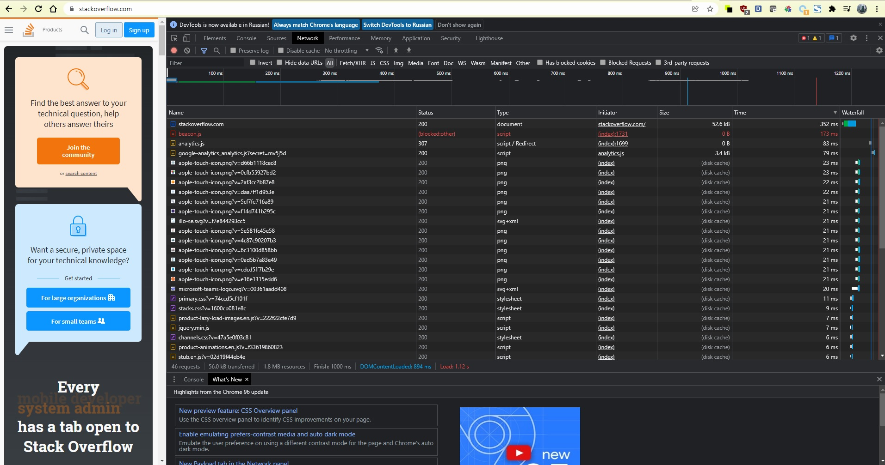

# Домашнее задание к занятию "3.6. Компьютерные сети, лекция 1"

1. Работа c HTTP через телнет.
- Подключитесь утилитой телнет к сайту stackoverflow.com
`telnet stackoverflow.com 80`
- отправьте HTTP запрос
```bash
GET /questions HTTP/1.0
HOST: stackoverflow.com
[press enter]
[press enter]
```
Ответ:

```shell
vagrant@vagrant:~$ telnet stackoverflow.com 80
Trying 151.101.193.69...
Connected to stackoverflow.com.
Escape character is '^]'.
GET /questions HTTP/1.0
HOST: stackoverflow.com

HTTP/1.1 301 Moved Permanently
cache-control: no-cache, no-store, must-revalidate
location: https://stackoverflow.com/questions
x-request-guid: c9c571d9-48af-41ec-98c6-945bd37da328
feature-policy: microphone 'none'; speaker 'none'
content-security-policy: upgrade-insecure-requests; frame-ancestors 'self' https://stackexchange.com
Accept-Ranges: bytes
Date: Thu, 02 Dec 2021 12:48:00 GMT
Via: 1.1 varnish
Connection: close
X-Served-By: cache-fra19166-FRA
X-Cache: MISS
X-Cache-Hits: 0
X-Timer: S1638449280.067751,VS0,VE92
Vary: Fastly-SSL
X-DNS-Prefetch-Control: off
Set-Cookie: prov=dbf84ebc-4d6a-90fe-23ba-5ced057dee95; domain=.stackoverflow.com; expires=Fri, 01-Jan-2055 00:00:00 GMT; path=/; HttpOnly

Connection closed by foreign host.
```
- В ответе укажите полученный HTTP код, что он означает?

Код состояния HTTP 301 или Moved Permanently (с англ. — «Перемещено навсегда») — стандартный код ответа HTTP, получаемый в ответ от сервера в ситуации, когда запрошенный ресурс был на постоянной основе перемещён в новое месторасположение, и указывающий на то, что текущие ссылки, использующие данный URL, должны быть обновлены. Адрес нового месторасположения ресурса указывается в поле Location получаемого в ответ заголовка пакета протокола HTTP.  


2. Повторите задание 1 в браузере, используя консоль разработчика F12.
- откройте вкладку `Network`
- отправьте запрос http://stackoverflow.com
- найдите первый ответ HTTP сервера, откройте вкладку `Headers`
- укажите в ответе полученный HTTP код.
- проверьте время загрузки страницы, какой запрос обрабатывался дольше всего?
- приложите скриншот консоли браузера в ответ.

Ответ:
- Status Code: 307 Internal Redirect
- Дольше всего 352 ms Request URL: https://stackoverflow.com/ Request Method: GET Status Code: 200 



3. Какой IP адрес у вас в интернете?

Ответ:
```shell
vagrant@vagrant:~$ curl ifconfig.me
185.105.3.199
```

4. Какому провайдеру принадлежит ваш IP адрес? Какой автономной системе AS? Воспользуйтесь утилитой `whois`

Ответ:

ORG-GISR2-RIPE  
G-Core Innovations S.a r.l.  
AS199524  
AS202422  
```shell
vagrant@vagrant:~$ whois -h whois.ripe.net 185.105.3.199
organisation:   ORG-GISR2-RIPE
org-name:       G-Core Innovations S.a r.l.

% Information related to '185.105.3.0/24AS199524'

route:          185.105.3.0/24
descr:          GCL-185-105-3-0-24
origin:         AS199524
mnt-by:         GCL1-MNT
created:        2019-06-26T14:09:47Z
last-modified:  2019-06-26T14:09:47Z
source:         RIPE

% Information related to '185.105.3.0/24AS202422'

route:          185.105.3.0/24
descr:          GCL-185-105-3-0-24
origin:         AS202422
mnt-by:         GCL1-MNT
created:        2021-09-14T11:05:43Z
last-modified:  2021-09-14T11:05:43Z
source:         RIPE
```
5. Через какие сети проходит пакет, отправленный с вашего компьютера на адрес 8.8.8.8? Через какие AS? Воспользуйтесь утилитой `traceroute  

Ответ:`

```shell
 traceroute -An 8.8.8.8
traceroute to 8.8.8.8 (8.8.8.8), 30 hops max, 60 byte packets
 1  172.22.240.1 [*]  0.458 ms  0.327 ms  0.300 ms
 2  192.168.100.1 [*]  86.068 ms  85.696 ms  85.638 ms
 3  185.105.3.3 [AS202422/AS199524]  85.615 ms  85.477 ms 185.105.3.2 [AS202422/AS199524]  85.314 ms
 4  10.255.8.181 [*]  85.259 ms  85.147 ms  84.975 ms
 5  10.255.8.97 [*]  690.504 ms 10.255.8.98 [*]  84.866 ms  690.491 ms
 6  10.255.44.130 [*]  690.520 ms 10.255.8.196 [*]  88.935 ms 10.255.44.130 [*]  90.639 ms
 7  92.223.126.73 [AS199524]  149.490 ms 92.223.124.73 [AS199524]  89.004 ms  88.943 ms
 8  108.170.241.161 [AS15169]  92.791 ms  92.588 ms 108.170.241.225 [AS15169]  92.466 ms
 9  8.8.8.8 [AS15169]  88.199 ms  90.377 ms 209.85.252.245 [AS15169]  148.613 ms

```

6. Повторите задание 5 в утилите `mtr`. На каком участке наибольшая задержка - delay?

Ответ:
На 7 хопе 340.7

```shell
mtr -zn 8.8.8.8
                                                                                                                         2021-12-02T16:29:44+0300
Keys:  Help   Display mode   Restart statistics   Order of fields   quit
                                                                                                                                                  Packets               Pings
 Host                                                                                                                                           Loss%   Snt   Last   Avg  Best  Wrst StDev
 1. AS???    172.22.240.1                                                                                                                        0.0%    42    1.1   0.6   0.3   1.1   0.2
 2. AS???    192.168.100.1                                                                                                                       0.0%    42   79.2  83.5  78.0 139.3  15.7
 3. AS202422 185.105.3.3                                                                                                                         0.0%    42   80.0  80.8  78.3  99.1   5.2
 4. AS???    10.255.8.182                                                                                                                        0.0%    42   79.0  79.1  78.5  80.6   0.4
 5. AS???    10.255.8.97                                                                                                                         0.0%    41   78.9  79.2  78.4  80.8   0.5
 6. AS???    10.255.8.196                                                                                                                        0.0%    41   83.0  83.1  82.0  90.6   1.3
 7. AS199524 92.223.124.73                                                                                                                       0.0%    41   83.8 102.0  82.2 340.7  67.9

```

7. Какие DNS сервера отвечают за доменное имя dns.google? Какие A записи? воспользуйтесь утилитой `dig`

Ответ:
```shell
dig +trace @8.8.8.8 dns.google

; <<>> DiG 9.16.1-Ubuntu <<>> +trace @8.8.8.8 dns.google
; (1 server found)
;; global options: +cmd
.                       74600   IN      NS      e.root-servers.net.
.                       74600   IN      NS      h.root-servers.net.
.                       74600   IN      NS      l.root-servers.net.
.                       74600   IN      NS      i.root-servers.net.
.                       74600   IN      NS      a.root-servers.net.
.                       74600   IN      NS      d.root-servers.net.
.                       74600   IN      NS      c.root-servers.net.
.                       74600   IN      NS      b.root-servers.net.
.                       74600   IN      NS      j.root-servers.net.
.                       74600   IN      NS      k.root-servers.net.
.                       74600   IN      NS      g.root-servers.net.
.                       74600   IN      NS      m.root-servers.net.
.                       74600   IN      NS      f.root-servers.net.

dns.google.             900     IN      A       8.8.4.4
dns.google.             900     IN      A       8.8.8.8


```

8. Проверьте PTR записи для IP адресов из задания 7. Какое доменное имя привязано к IP? воспользуйтесь утилитой `dig`

Ответ:

```shell
dig -x 8.8.8.8 +short
dns.google.
dig -x 8.8.4.4 +short
dns.google.

dig -x 8.8.4.4

; <<>> DiG 9.16.1-Ubuntu <<>> -x 8.8.4.4
;; global options: +cmd
;; Got answer:
;; ->>HEADER<<- opcode: QUERY, status: NOERROR, id: 11148
;; flags: qr rd ra; QUERY: 1, ANSWER: 1, AUTHORITY: 0, ADDITIONAL: 1

;; OPT PSEUDOSECTION:
; EDNS: version: 0, flags:; udp: 512
;; QUESTION SECTION:
;4.4.8.8.in-addr.arpa.          IN      PTR

;; ANSWER SECTION:
4.4.8.8.in-addr.arpa.   17996   IN      PTR     dns.google.

;; Query time: 20 msec
;; SERVER: 8.8.8.8#53(8.8.8.8)
;; WHEN: Thu Dec 02 17:22:45 MSK 2021
;; MSG SIZE  rcvd: 73


```

В качестве ответов на вопросы можно приложите лог выполнения команд в консоли или скриншот полученных результатов.

