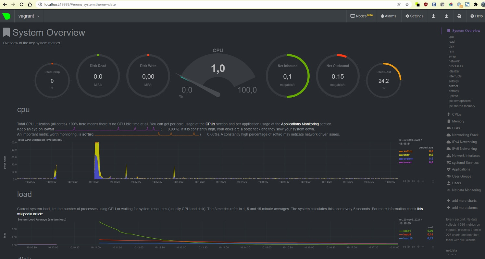

# Домашнее задание к занятию "3.4. Операционные системы, лекция 2"

1. На лекции мы познакомились с [node_exporter](https://github.com/prometheus/node_exporter/releases). В демонстрации его исполняемый файл запускался в background. Этого достаточно для демо, но не для настоящей production-системы, где процессы должны находиться под внешним управлением. Используя знания из лекции по systemd, создайте самостоятельно простой [unit-файл](https://www.freedesktop.org/software/systemd/man/systemd.service.html) для node_exporter:

    * поместите его в автозагрузку,
    * предусмотрите возможность добавления опций к запускаемому процессу через внешний файл (посмотрите, например, на `systemctl cat cron`),
    * удостоверьтесь, что с помощью systemctl процесс корректно стартует, завершается, а после перезагрузки автоматически поднимается.

Ответ:
Добавил $EXTRA_OPTS
systemd будет подгружать переменные окружения при старте node explorer из файла /etc/default/node_explorer, а параметры запуска искать в переменной EXTRA_OPTS
или в EnvironmentFile можно задать  переменную MY_OPTIONS="-h" в ExecStart указать основную команду ExecStart=home/vagrant/node_exporter-1.3.0.linux-amd64/node_exporter $MY_OPTIONS
```
vagrant@vagrant:~$ sudo systemctl enable node_exporter.service
vagrant@vagrant:~$ ps -e | grep node_exporter
    721 ?        00:00:00 node_exporter
vagrant@vagrant:~$ sudo systemctl stop node_exporter
vagrant@vagrant:~$ ps -e | grep node_exporter
vagrant@vagrant:~$ sudo systemctl start node_exporter
vagrant@vagrant:~$ ps -e | grep node_exporter
   1079 ?        00:00:00 node_exporter
vagrant@vagrant:~$    
vagrant@vagrant:~$ cat /etc/systemd/system/node_exporter.service
[Unit]
Description=Node Exporter

[Service]
ExecStart=ExecStart=home/vagrant/node_exporter-1.3.0.linux-amd64/node_exporter -f -P $MY_OPTIONS  или $EXTRA_OPTS
EnvironmentFile=/etc/default/node_exporter

[Install]
WantedBy=default.target

vagrant@vagrant:~$ sudo cat /proc/1079/environ
LANG=en_US.UTF-8PATH=/usr/local/sbin:/usr/local/bin:/usr/sbin:/usr/bin:/sbin:
/bin:/snap/binINVOCATION_ID=db56e3bbc1454714a6acc059387d5ed5JOURNAL_STREAM=9:28963
Myvar=Tim  

vagrant@vagrant:~$ cat /etc/default/node_exporter
Myvar=Tim

```


2. Ознакомьтесь с опциями node_exporter и выводом `/metrics` по-умолчанию. Приведите несколько опций, которые вы бы выбрали для базового мониторинга хоста по CPU, памяти, диску и сети.

Ответ:

```
node_cpu_seconds_total{cpu="0",mode="idle"} 648.27  
node_cpu_seconds_total{cpu="0",mode="iowait"} 1  
node_cpu_seconds_total{cpu="0",mode="irq"} 0  
node_cpu_seconds_total{cpu="0",mode="nice"} 0  
node_cpu_seconds_total{cpu="0",mode="softirq"} 0.58  
node_cpu_seconds_total{cpu="0",mode="steal"} 0  
node_cpu_seconds_total{cpu="0",mode="system"} 14.73  
node_cpu_seconds_total{cpu="0",mode="user"} 5.39  
node_cpu_seconds_total{cpu="1",mode="idle"} 649. 
node_cpu_seconds_total{cpu="1",mode="iowait"} 0.76
node_cpu_seconds_total{cpu="1",mode="irq"} 0
node_cpu_seconds_total{cpu="1",mode="nice"} 0
node_cpu_seconds_total{cpu="1",mode="softirq"} 0.5
node_cpu_seconds_total{cpu="1",mode="steal"} 0
node_cpu_seconds_total{cpu="1",mode="system"} 14.74
node_cpu_seconds_total{cpu="1",mode="user"} 5.22

node_memory_MemAvailable_bytes 7.05900544e+08
node_memory_MemFree_bytes 4.92986368e+08

node_disk_writes_completed_total{device="dm-0"} 4183
node_disk_writes_completed_total{device="sda"} 3248
node_disk_writes_completed_total{device="sr0"} 0

node_disk_reads_completed_total{device="dm-0"} 8731
node_disk_reads_completed_total{device="sda"} 6516
node_disk_reads_completed_total{device="sr0"} 0

node_disk_io_time_seconds_total{device="dm-0"} 10.116
node_disk_io_time_seconds_total{device="sda"} 10.3
node_disk_io_time_seconds_total{device="sr0"} 0

node_disk_io_now{device="dm-0"} 0
node_disk_io_now{device="sda"} 0
node_disk_io_now{device="sr0"} 0

node_network_up{device="eth0"} 1
node_network_up{device="lo"} 0

node_network_transmit_errs_total{device="eth0"} 0
node_network_transmit_errs_total{device="lo"} 0

node_network_transmit_drop_total{device="eth0"} 0
node_network_transmit_drop_total{device="lo"} 0

node_network_transmit_bytes_total{device="eth0"} 71185
node_network_receive_bytes_total{device="eth0"} 83437
```


3. Установите в свою виртуальную машину [Netdata](https://github.com/netdata/netdata). Воспользуйтесь [готовыми пакетами](https://packagecloud.io/netdata/netdata/install) для установки (`sudo apt install -y netdata`). После успешной установки:
    * в конфигурационном файле `/etc/netdata/netdata.conf` в секции [web] замените значение с localhost на `bind to = 0.0.0.0`,
    * добавьте в Vagrantfile проброс порта Netdata на свой локальный компьютер и сделайте `vagrant reload`:

    ```bash
    config.vm.network "forwarded_port", guest: 19999, host: 19999
    ```

    После успешной перезагрузки в браузере *на своем ПК* (не в виртуальной машине) вы должны суметь зайти на `localhost:19999`. Ознакомьтесь с метриками, которые по умолчанию собираются Netdata и с комментариями, которые даны к этим метрикам.

Ответ:

```
vagrant@vagrant:~$ sudo lsof -i :19999
COMMAND PID    USER   FD   TYPE DEVICE SIZE/OFF NODE NAME
netdata 755 netdata    4u  IPv4  24870      0t0  TCP *:19999 (LISTEN)
netdata 755 netdata   21u  IPv4  32473      0t0  TCP vagrant:19999->_gateway:1238 (ESTABLISHED)
netdata 755 netdata   22u  IPv4  32475      0t0  TCP vagrant:19999->_gateway:1241 (ESTABLISHED)
netdata 755 netdata   24u  IPv4  32477      0t0  TCP vagrant:19999->_gateway:1242 (ESTABLISHED)
netdata 755 netdata   25u  IPv4  32479      0t0  TCP vagrant:19999->_gateway:1243 (ESTABLISHED)
netdata 755 netdata   26u  IPv4  33744      0t0  TCP vagrant:19999->_gateway:1249 (ESTABLISHED)
netdata 755 netdata   27u  IPv4  33746      0t0  TCP vagrant:19999->_gateway:1253 (ESTABLISHED)

vagrant@vagrant:~$ netdata -v
netdata v1.19.0

```



Keep an eye on iowait 
 (0,00%). If it is constantly high, your disks are a bottleneck and they slow your system down.
An important metric worth monitoring, is softirq   
 (-%). A constantly high percentage of softirq may indicate network driver issues.  
Current system load, i.e. the number of processes using CPU or waiting for system resources (usually CPU and disk). The 3 metrics refer to 1, 5 and 15 minute averages. The system calculates this once every 5 seconds. For more information check this wikipedia article  

4.Можно ли по выводу `dmesg` понять, осознает ли ОС, что загружена не на настоящем оборудовании, а на системе виртуализации?

Ответ:
Да

```
vagrant@vagrant:~$ dmesg | grep virt
[    0.148451] Booting paravirtualized kernel on VMware hypervisor
[   15.313288] systemd[1]: Detected virtualization vmware.
```


5.Как настроен sysctl `fs.nr_open` на системе по-умолчанию? Узнайте, что означает этот параметр. Какой другой существующий лимит не позволит достичь такого числа (`ulimit --help`)?  

Ответ:
```
vagrant@vagrant:~$ /sbin/sysctl -n fs.nr_open
1048576
vagrant@vagrant:~$ cat /proc/sys/fs/file-max
9223372036854775807
vagrant@vagrant:~$
```
fs.nr_open Это максимальное число открытых дескрипторов для ядра (системы), для пользователя задать больше этого числа нельзя (если не менять).   
Число задается кратное 1024, в данном случае =1024*1024.   
макс.предел ОС можно посмотреть так cat /proc/sys/fs/file-max

```
vagrant@vagrant:~$ ulimit -Sn
1024
vagrant@vagrant:~$ ulimit -Hn
1048576
```
ulimit -Sn мягкий лимит (так же ulimit -n)на пользователя (может быть увеличен процессов в процессе работы)  
ulimit -Hn жесткий лимит на пользователя (не может быть увеличен, только уменьшен)
Оба ulimit -n НЕ могут превысить системный fs.nr_open  


6.Запустите любой долгоживущий процесс (не `ls`, который отработает мгновенно, а, например, `sleep 1h`) в отдельном неймспейсе процессов; покажите, что ваш процесс работает под PID 1 через `nsenter`. Для простоты работайте в данном задании под root (`sudo -i`). Под обычным пользователем требуются дополнительные опции (`--map-root-user`) и т.д.

Ответ:
Не получается выполнить это задание
```
root@vagrant:~# lsns
        NS TYPE   NPROCS   PID USER             COMMAND
4026531835 cgroup    170     1 root             /sbin/init
4026531836 pid       164     1 root             /sbin/init
4026531837 user      170     1 root             /sbin/init
4026531838 uts       167     1 root             /sbin/init
4026531839 ipc       170     1 root             /sbin/init
4026531840 mnt       146     1 root             /sbin/init
4026531860 mnt         1    21 root             kdevtmpfs
4026531992 net       170     1 root             /sbin/init
4026532525 mnt         1   429 root             /lib/systemd/systemd-udevd
4026532526 uts         1   429 root             /lib/systemd/systemd-udevd
4026532552 mnt         1   646 systemd-timesync /lib/systemd/systemd-timesyncd
4026532553 uts         1   646 systemd-timesync /lib/systemd/systemd-timesyncd
4026532554 mnt         1  1234 systemd-network  /lib/systemd/systemd-networkd
4026532564 mnt         1   731 systemd-resolve  /lib/systemd/systemd-resolved
4026532566 mnt         1  2623 root             sleep 1h
4026532567 pid         1  2623 root             sleep 1h
4026532568 mnt         1  2646 root             sleep 1h
4026532569 pid         1  2646 root             sleep 1h
4026532570 mnt         9  2731 root             unshare -f --pid --mount-proc /bin/bash
4026532571 pid         3  2732 root             /bin/bash
4026532572 mnt         2  3134 root             unshare -f --pid --mount-proc sleep 1h
4026532573 pid         1  3135 root             sleep 1h
4026532620 uts         1   763 root             /lib/systemd/systemd-logind
4026532621 mnt         1   754 root             /usr/sbin/irqbalance --foreground
4026532622 mnt         1   763 root             /lib/systemd/systemd-logind
4026532623 mnt         4   755 netdata          /usr/sbin/netdata -D
root@vagrant:~# nsenter --target 4026532572 --pid --mount
nsenter: cannot open /proc/4026532572/ns/pid: No such file or directory
root@vagrant:~# nsenter --target 4026532573 --pid --mount
nsenter: cannot open /proc/4026532573/ns/pid: No such file or directory
root@vagrant:~# nsenter --target 3134 --pid --mount
nsenter: reassociate to namespace 'ns/pid' failed: Invalid argument
root@vagrant:~# nsenter --target 3135 --pid --mount
nsenter: reassociate to namespace 'ns/pid' failed: Invalid argument
```

7.Найдите информацию о том, что такое `:(){ :|:& };:`. Запустите эту команду в своей виртуальной машине Vagrant с Ubuntu 20.04 (**это важно, поведение в других ОС не проверялось**). Некоторое время все будет "плохо", после чего (минуты) – ОС должна стабилизироваться. Вызов `dmesg` расскажет, какой механизм помог автоматической стабилизации. Как настроен этот механизм по-умолчанию, и как изменить число процессов, которое можно создать в сессии?

Ответ:  
Функция внутри "{}", судя по всему с именем ":" , которая после определения в строке запускает саму себя.
пораждает два фоновых процесса самой себя, получается этакое бинарное дерево плодящее процессы 

cgroup: fork rejected by pids controller in /user.slice/user-1000.slice/session-4.scope  
cgroup: fork rejected by pids controller in /user.slice/user-1000.slice/session-11.scope

Система на основании этих файлов в пользовательской зоне ресурсов имеет определенное ограничение на создаваемые ресурси 
и соответсвенно при превышении начинает блокировать создание числа 

Если установить ulimit -u 50 - число процессов будет ограниченно 50 для пользователя.

 
 ---

## Как сдавать задания

Обязательными к выполнению являются задачи без указания звездочки. Их выполнение необходимо для получения зачета и диплома о профессиональной переподготовке.

Задачи со звездочкой (*) являются дополнительными задачами и/или задачами повышенной сложности. Они не являются обязательными к выполнению, но помогут вам глубже понять тему.

Домашнее задание выполните в файле readme.md в github репозитории. В личном кабинете отправьте на проверку ссылку на .md-файл в вашем репозитории.

Также вы можете выполнить задание в [Google Docs](https://docs.google.com/document/u/0/?tgif=d) и отправить в личном кабинете на проверку ссылку на ваш документ.
Название файла Google Docs должно содержать номер лекции и фамилию студента. Пример названия: "1.1. Введение в DevOps — Сусанна Алиева".

Если необходимо прикрепить дополнительные ссылки, просто добавьте их в свой Google Docs.

Перед тем как выслать ссылку, убедитесь, что ее содержимое не является приватным (открыто на комментирование всем, у кого есть ссылка), иначе преподаватель не сможет проверить работу. Чтобы это проверить, откройте ссылку в браузере в режиме инкогнито.

[Как предоставить доступ к файлам и папкам на Google Диске](https://support.google.com/docs/answer/2494822?hl=ru&co=GENIE.Platform%3DDesktop)

[Как запустить chrome в режиме инкогнито ](https://support.google.com/chrome/answer/95464?co=GENIE.Platform%3DDesktop&hl=ru)

[Как запустить  Safari в режиме инкогнито ](https://support.apple.com/ru-ru/guide/safari/ibrw1069/mac)

Любые вопросы по решению задач задавайте в чате Slack.

---
