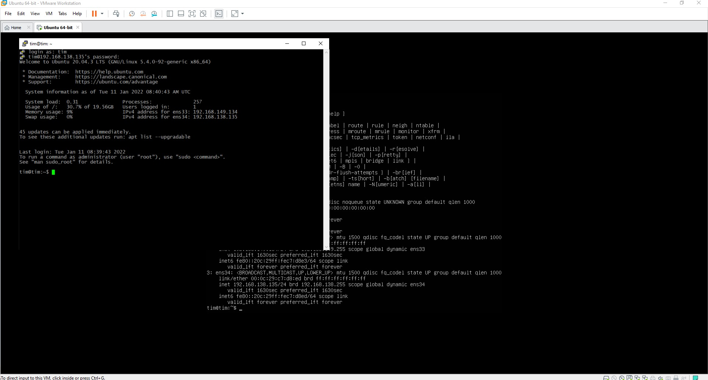
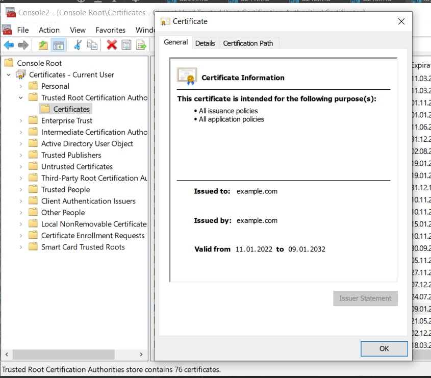
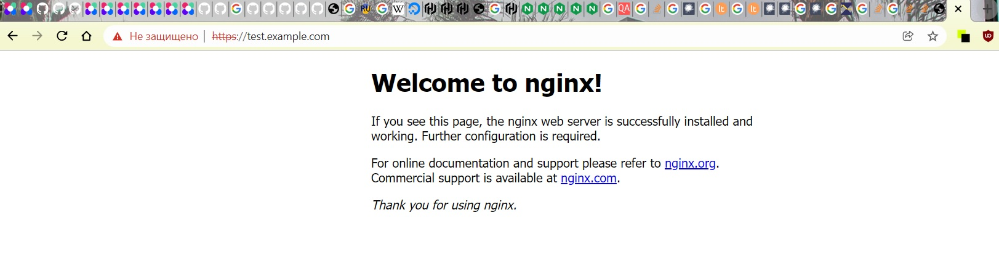

# Курсовая работа по итогам модуля "DevOps и системное администрирование"

## Задание

1. Создайте виртуальную машину Linux.


2. Установите ufw и разрешите к этой машине сессии на порты 22 и 443, при этом трафик на интерфейсе localhost (lo) должен ходить свободно на все порты.
```shell
tim@tim:~$ sudo ufw status
Status: inactive
tim@tim:~$ sudo apt-get install ufw
Reading package lists... Done
Building dependency tree
Reading state information... Done
The following packages will be upgraded:
  ufw
1 upgraded, 0 newly installed, 0 to remove and 44 not upgraded.
Need to get 147 kB of archives.
After this operation, 3,072 B of additional disk space will be used.
Get:1 http://lu.archive.ubuntu.com/ubuntu focal-updates/main amd64 ufw all 0.36-6ubuntu1 [147 kB]
Fetched 147 kB in 13s (11.1 kB/s)
Preconfiguring packages ...
(Reading database ... 71558 files and directories currently installed.)
Preparing to unpack .../ufw_0.36-6ubuntu1_all.deb ...
Unpacking ufw (0.36-6ubuntu1) over (0.36-6) ...
Setting up ufw (0.36-6ubuntu1) ...
Processing triggers for man-db (2.9.1-1) ...
Processing triggers for rsyslog (8.2001.0-1ubuntu1.1) ...
Processing triggers for systemd (245.4-4ubuntu3.11) ...

tim@tim:~$ sudo ufw enable
Command may disrupt existing ssh connections. Proceed with operation (y|n)? y
Firewall is active and enabled on system startup
tim@tim:~$ sudo ufw status
Status: active
tim@tim:~$ sudo ufw app list
Available applications:
  OpenSSH
tim@tim:~$ sudo ufw allow OpenSSH
Rule added
Rule added (v6)
tim@tim:~$ sudo ufw allow https
Rule added
Rule added (v6)
tim@tim:~$ sudo ufw status
Status: active

To                         Action      From
--                         ------      ----
OpenSSH                    ALLOW       Anywhere
443/tcp                    ALLOW       Anywhere
OpenSSH (v6)               ALLOW       Anywhere (v6)
443/tcp (v6)               ALLOW       Anywhere (v6)

```


3. Установите hashicorp vault ([инструкция по ссылке](https://learn.hashicorp.com/tutorials/vault/getting-started-install?in=vault/getting-started#install-vault)).
```shell
tim@tim:~$ vault --version
Vault v1.9.2 (f4c6d873e2767c0d6853b5d9ffc77b0d297bfbdf)
```
4. Cоздайте центр сертификации по инструкции ([ссылка](https://learn.hashicorp.com/tutorials/vault/pki-engine?in=vault/secrets-management)) и выпустите сертификат для использования его в настройке веб-сервера nginx (срок жизни сертификата - месяц).
```shell
tim@tim:~$ vault write pki_int/issue/example-dot-com common_name="test.example.com" ttl="730h"Key                 Value
---                 -----
ca_chain            [-----BEGIN CERTIFICATE-----
-----END CERTIFICATE-----]
certificate         -----BEGIN CERTIFICATE-----
...
tim@tim:~$ ls
CA_cert.crt  intermediate.cert.pem  pki_intermediate.csr  private.key  test.example.com.crt

```

5. Установите корневой сертификат созданного центра сертификации в доверенные в хостовой системе.


6. Установите nginx.
```shell
tim@tim:/home/keys$ sudo systemctl status nginx
● nginx.service - A high performance web server and a reverse proxy server
     Loaded: loaded (/lib/systemd/system/nginx.service; enabled; vendor preset: enabled)
     Active: active (running) since Tue 2022-01-11 13:16:08 UTC; 31s ago
       Docs: man:nginx(8)
    Process: 13374 ExecStartPre=/usr/sbin/nginx -t -q -g daemon on; master_process on; (code=exited, status=0/SUCCESS)
    Process: 13386 ExecStart=/usr/sbin/nginx -g daemon on; master_process on; (code=exited, status=0/SUCCESS)
   Main PID: 13387 (nginx)
      Tasks: 3 (limit: 4578)
     Memory: 3.8M
     CGroup: /system.slice/nginx.service
             ├─13387 nginx: master process /usr/sbin/nginx -g daemon on; master_process on;
             ├─13388 nginx: worker process
             └─13389 nginx: worker process

Jan 11 13:16:08 tim systemd[1]: Starting A high performance web server and a reverse proxy server...
Jan 11 13:16:08 tim systemd[1]: Started A high performance web server and a reverse proxy server.

```
7. По инструкции ([ссылка](https://nginx.org/en/docs/http/configuring_https_servers.html)) настройте nginx на https, используя ранее подготовленный сертификат:
  - можно использовать стандартную стартовую страницу nginx для демонстрации работы сервера;
  - можно использовать и другой html файл, сделанный вами;
```shell
tim@tim:/home/keys$ cat /etc/nginx/nginx.conf
user www-data;
worker_processes auto;
pid /run/nginx.pid;
include /etc/nginx/modules-enabled/*.conf;

events {
        worker_connections 768;
        # multi_accept on;
}

http {
    server {
    listen              443 ssl;
    server_name         test.example.com;
    ssl_certificate     /home/keys/test.example.com.crt;
    ssl_certificate_key /home/keys/private.key;
    ssl_protocols       TLSv1 TLSv1.1 TLSv1.2;
    ssl_ciphers         HIGH:!aNULL:!MD5;

```
8. Откройте в браузере на хосте https адрес страницы, которую обслуживает сервер nginx.

9. Создайте скрипт, который будет генерировать новый сертификат в vault:
  - генерируем новый сертификат так, чтобы не переписывать конфиг nginx;
  - перезапускаем nginx для применения нового сертификата.
```shell
#!/usr/bin/env bash

export VAULT_ADDR=http://127.0.0.1:8200
export VAULT_TOKEN=root

vault write -format=json pki_int/issue/example-dot-com common_name="test.example.com" ttl="740h" > /home/keys/test.example.com.crt.json

cat /home/keys/test.example.com.crt.json | jq -r '.data.certificate' >  /etc/nginx/ssl/test.example.com.crt
cat /home/keys/test.example.com.crt.json | jq -r '.data.ca_chain[0]' >> /etc/nginx/ssl/test.example.com.crt
cat /home/keys/test.example.com.crt.json | jq -r '.data.private_key' >  /etc/nginx/ssl/test.example.com.key
systemctl reload nginx
```
10. Поместите скрипт в crontab, чтобы сертификат обновлялся какого-то числа каждого месяца в удобное для вас время.
```shell
tim@tim:/home/keys$ cat /etc/crontab
# /etc/crontab: system-wide crontab
# Unlike any other crontab you don't have to run the `crontab'
# command to install the new version when you edit this file
# and files in /etc/cron.d. These files also have username fields,
# that none of the other crontabs do.

SHELL=/bin/sh
PATH=/usr/local/sbin:/usr/local/bin:/sbin:/bin:/usr/sbin:/usr/bin

# Example of job definition:
# .---------------- minute (0 - 59)
# |  .------------- hour (0 - 23)
# |  |  .---------- day of month (1 - 31)
# |  |  |  .------- month (1 - 12) OR jan,feb,mar,apr ...
# |  |  |  |  .---- day of week (0 - 6) (Sunday=0 or 7) OR sun,mon,tue,wed,thu,fri,sat
# |  |  |  |  |
# *  *  *  *  * user-name command to be executed
17 *    * * *   root    cd / && run-parts --report /etc/cron.hourly
25 6    * * *   root    test -x /usr/sbin/anacron || ( cd / && run-parts --report /etc/cron.daily )
47 6    * * 7   root    test -x /usr/sbin/anacron || ( cd / && run-parts --report /etc/cron.weekly )
52 6    1 * *   root    test -x /usr/sbin/anacron || ( cd / && run-parts --report /etc/cron.monthly )
#
59 23   30 * *  root    /home/keys/cert.sh

```
## Результат

Результатом курсовой работы должны быть снимки экрана или текст:

- Процесс установки и настройки ufw
- Процесс установки и выпуска сертификата с помощью hashicorp vault
- Процесс установки и настройки сервера nginx
- Страница сервера nginx в браузере хоста не содержит предупреждений 
- Скрипт генерации нового сертификата работает (сертификат сервера ngnix должен быть "зеленым")
- Crontab работает (выберите число и время так, чтобы показать что crontab запускается и делает что надо)

## Как сдавать курсовую работу

Курсовую работу выполните в файле readme.md в github репозитории. В личном кабинете отправьте на проверку ссылку на .md-файл в вашем репозитории.

Также вы можете выполнить задание в [Google Docs](https://docs.google.com/document/u/0/?tgif=d) и отправить в личном кабинете на проверку ссылку на ваш документ.
Если необходимо прикрепить дополнительные ссылки, просто добавьте их в свой Google Docs.

Перед тем как выслать ссылку, убедитесь, что ее содержимое не является приватным (открыто на комментирование всем, у кого есть ссылка), иначе преподаватель не сможет проверить работу. 
Ссылка на инструкцию [Как предоставить доступ к файлам и папкам на Google Диске](https://support.google.com/docs/answer/2494822?hl=ru&co=GENIE.Platform%3DDesktop).